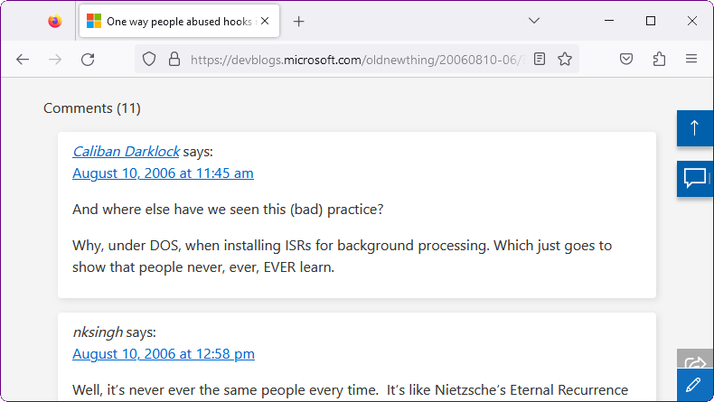

# The Old New Thing userscript

A userscript for the excellent [The Old New
Thing](https://devblogs.microsoft.com/oldnewthing/) blog which does the
following:

* Restores old comments from an archive which is hosted in this repository. The
  archive was copied from
  [bytepointer.com](https://bytepointer.com/resources/old_new_thing/index.htm),
  and was adjusted to work with the userscript. The original archive is also
  saved in this repository as a reference and a backup.

* Fixes most old blog links which no longer work.

## Installation

* Install [Tampermonkey](https://www.tampermonkey.net/) or a similar userscript
  manager extension.

* Install the userscript [from
  here](https://m417z.com/the-old-new-thing-userscript/the-old-new-thing-userscript.user.js).
